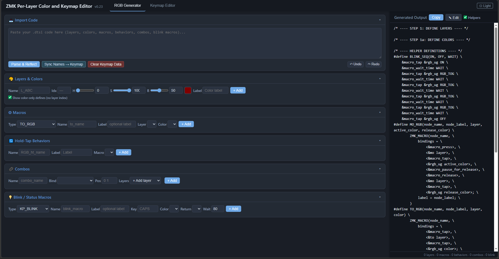
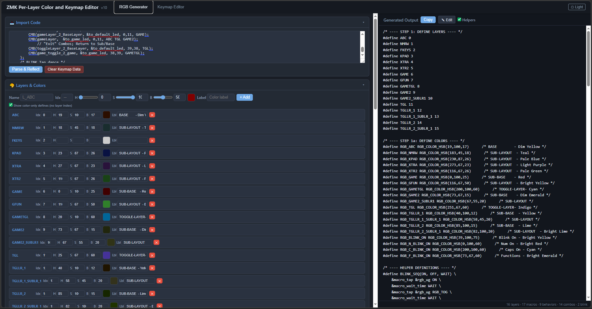
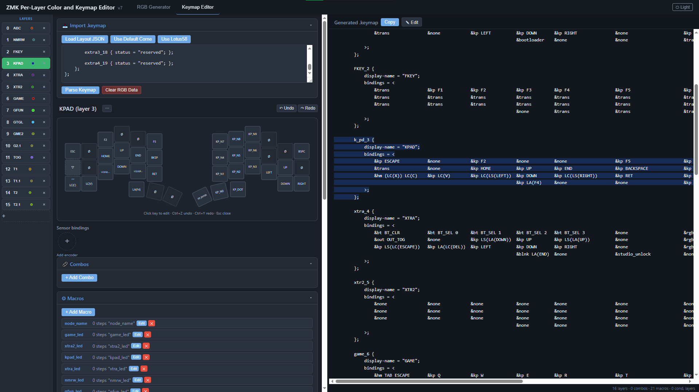
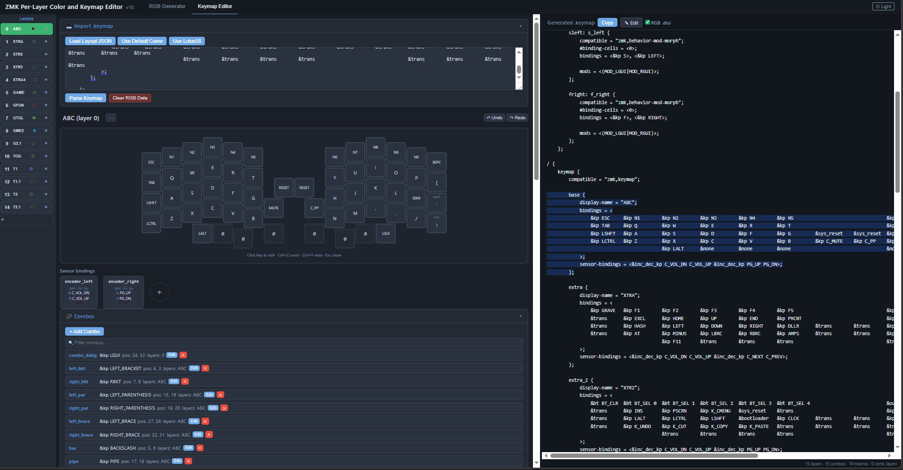

# PandaKB ZMK Corne v3 RGB BLE — Per-Layer RGB

## Overview

This is a **VERY AMATEUR** attempt at implementing "Per-layer RGB colors into the firmware" (NOT PER-KEY, 1 COLOR PER LAYER). There were a couple of roadblocks, but after much further reading, and thought, I came up with my own, albeit very messy, firmware utilizing macros and hold-taps to get this effect. This was just a small weekend project to help me understand ZMK a little bit more and to have a little "fun" with my build. I have the macros and hold-taps the way I like it, you're free to change the code if you wish, I'm sure there are ways I could simplify this code even more since I don't really know much at all; but for now it functions. This is more explained for someone, like myself, who has no background in ANY coding.
## Attribution
- Thanks to Nick Coutsos with his keymap editor (https://nickcoutsos.github.io/keymap-editor/) for helping me create macros and hold-taps. His website helped a total noob like myself the "right" way to structure this for my first time ever digging into code.
    **His keymap editor helped more than he would ever know this process has been streamlined so well now**
- And surprisingly CoPilot as well, for being able to work with my framework and show me some new tricks that I'm sure more seasoned veteran coders know about.
- This project is experimental; reuse at your own risk. 

Enjoy — Pull requests or suggestions to simplify and improve the code are welcome. Hopefully there is more work in the future with the RGB functionality, my knowledge is non-existent coming to this stuff; this was mostly done with the help of the docs so the idea is nothing new. It's just a fun little thing to make your keyboard do in the mean time until more RGB functions are upstreamed.

---

## Table of contents
- [Highlights / Features](#highlights--features)
- [Files of interest](#files-of-interest)
- [How it works](#how-it-works)
- [Game layer](#game-layer)
- [Toggle-Layer system](#toggle-layer-layer-system)
- [Notes and caveats](#notes-and-caveats)
- [AI update](#ai-update)
- [To Do](#to-do)
---

## Highlights / Features

- 13 layers (each with its own RGB color). The default/base layer uses a warm, dim orange/yellow.
- A deliberately designed "game" layer to reduce accidental activation.
- A deliberately designed "Toggle Layer" function for multiple dedicated layers
- Per-layer RGB macro definitions moved out of the main keymap into a separate file for maintainability.
- Layer RGB activation uses hold-taps and combo patterns to avoid running macros on simple taps.
- A CapsLock blink indicator has been implemented (logic can be improved); can extend to NumLock or other indicators.
- The `config/corne-rgb.dtsi` file should in theory work in any other keyboard since it doesn't affect the key map. We can isolate the RGB functions into one file for easier editing while only worrying about the layers in the .keymap file. (ty AI)
- **NEW** Tap Dance Blink, CapsLock, And NumLock have been intrigrated. When you "activate" NumLock/CapsLock using the tap-dance function the keyboard will now "flash" an appropriate color to indicate the press. 

---

## Files of Interest

- `config/corne.keymap` — main keymap (focused on layer bindings).
- `config/corne-rgb.dtsi` — RGB macros and combos (per-layer color definitions and modular macros).
  - Include it in your `.keymap` with: `#include "corne-rgb.dtsi"` (adjust filename as needed).

---

## How It Works

- Layer color changes are triggered by macros in conjunction with `hold-taps`. This prevents unintended LED changes on simple taps.
- Hold-tap behavior is used to simulate home-row-mod behavior for layer activation, while RGB macros run only when the layer is actually activated.
- Combos are used for deliberate multi-key activation (for example, the game layer requires a simultaneous press of two keys on separate halves).
- Further instructions for implementing the code can be found in the `"How_to_use_corne-rgb.dtsi"` file, I tried my best to format it to be understandable, my peanutbrain was running on bong water, cigarettes, and solder fumes at 3AM (much liek now) 

---

## Game Layer

- Activation: press the top-left key on the left half AND the top-right key on the right half at the same time. This toggles the "game" layer and sets its RGB color.
- Deactivation: press the same combo again to return to the base layer and its color.
- The game layer includes a nested "functions" layer to access F-keys and numbers for convenience while gaming.
- Recommendation: use wired USB and switch the keyboard output to USB when using the game layer to avoid any potential input lag over BLE.
- Along with it's "own" "Toggle-Layer" system designed for game profiles.

---

## "Toggle-Layer" Layer System
- How to use: press the inward thumb keys to enter the Toggle Layer on both halves, then press a top-row key (or other assigned key) to switch to one of the toggled sub-layers. Press the gateway combo again to return to the Toggle Layer, then press it a second time to go back to the Base Layer. 

- A separate "Toggle Layer" is activated by a pair of inward thumb keys (both halves). This acts as the gateway to multiple "Toggeled Layers".
- Toggled layers selected from the gateway can house their own "Sub-layer" with an individual RGB color. These sub-layers let you create dedicated small sub-layouts (each with its own distinct RGB setting), think momentary layers.
- The Toggle Layer reduces accidental activation, and less "key clutter" while allowing multiple dedicated layouts for different tasks (e.g., Photoshop, coding, emails, gaming).

- When making a Toggled Layer it's ***IMPORTANT*** that you add all sub-layouts, you'll be using in the Toggled Layer, BELOW the Toggled Layer! To avoid any "layer meshing"; Layers can get "stuck" on top of each other [See zmk.dev #Layers](https://zmk.dev/docs/keymaps#layers)
- **CONSTRUCTING YOUR LAYERS RIGHT IS THE MOST IMPORTANT PART OF THIS WHOLE PROCESS, IF YOU JUST START ASSIGNING COLORS TO LAYERS WITH MACROS/BEHAVIORS AND IF THE LAYERS AREN'T "STACKED" RIGHT THEN EVERYTHING YOU DID WON'T WORK AS INTENED. PATH YOUR LAYERS CORRECTLY!**
- or, look at my layout/keymap, or layer numbers in `corne-rgb.dtsi` for an idea of how I pathed the layers.
  - You wouldnt have Layer 12 with a key to go to layer 2, since there could be layers inbetween that may "bleed" key presses through the layer you are trying to "dig" to; or vice versa. It's good practice to put any "sub-layouts" below the toggled layer in your .keymap. Layer12 is the new "Sub-Base Layer", so Layer13 should be it's "sub-layout" in the sequence.

  - Red Bring Us To the Game Layer **(MUST BE ON BASE LAYER TO ACCESS)**
    - To leave the Game Layer press the combo twice until you return to the BASE layer
  - Blue Brings Us To the "Toggle-Layer" Layer **(MUST BE ON BASE LAYER TO ACCESS)**
    - To return to the BASE layer you can press the thumb buttons twice until you return to the BASE layer
  - Purple Brings Us to the "Game Toggle-Layer" Layer **(MUST BE ON GAME LAYER TO ACCESS)**

---

## Notes

- Early implementation mistake: layer-tap behavior was inside macros, causing macros to run on every layer-tap. I separated the layer-tap from macros so simple taps no longer trigger LED changes.
- There were some timing/overlap issues when combining certain macros (e.g., returning to default color after leaving the game layer). Conditional layer combos helped mitigate this.
- The current approach is functional but can likely be simplified; contributions and suggestions are welcome.

---

## AI Update

I used Copilot to help modularize and refine the macros and combos. The modular structure now makes it easier to add new layers and corresponding RGB behaviors — add a layer color/macro in `corne-rgb.dtsi` and #include that file in your keymap.
### **NEW** AI CONSTRUCTED RGB BUILDER
- I got lazy updating my colors and just had AI construct a tool to help streamline the process since we were mostly working with 3 macros, it just got redundant coding them.
  - There is an integrated keymap editor I pulled mostly from (https://nickcoutsos.github.io/keymap-editor/) for an idea, all credit goes to him for the keymap editor functionality. I havent really tried it out but it seems mostly functional.
  - There are certainly bugs(its ALL AI written), I havent really used this much yet; I can say that the RGB builder does work well enough so feel free to use it you want, there are included "helpers" in the generator.
 **___Should NOTE that this has only been cofigured for Lotus58 and Corne Keymaps, it says you can add a .json but I never tried.___**

---

  - The "Blink/status" macro is experimental, it works but I'm not sure if it's really "helpful". I only use it for a few visual indications but feel free to expreiment with the idea.
  - Any color you "assign" a layer in the RGB tool gets shown as a little colored dot on the layers in the keymap editor UI.
  - This has most of the capabilities of the orignial keymap editor, minus some bugs and obvious UI improvements that could be made, but with the added functionality of a RGB generator.
     - You should be able to edit your keymap and assign colors to the layer from the tool.
     - Layers made in the keymap get "reflected" into the RGB tool for easy editing.
     - This is supposed to work on a 2 file system.
         - 1 is your .keymap and the other is a .dtsi file
         - In your keymap you just add `#include "corne-rgb.dtsi"` (adjust filename as needed) to the top of your keymap.
---

## To Do

~~- Improve the CapsLock blink logic and add a similar blink/indicator for NumLock and other toggles.~~
~~- Optional: document exact combo key positions for common Corne layouts (for clarity).~~
- I will probably clean up the code more since it's boasting a whooping 700kb of memory.
- I think I'm "done", most of the "framework" is now there, all that's left is to implement the new structured code onto any new layers.
- If anyone can think of something I'm open to suggestions but I "think" I maximized the capabilities of the basic 3.0 ZMK RGB functions.  

---

Edited with AI for clarity
# PandaKB ZMK Corne v3 RGB BLE — Per-Layer RGB

## Overview

This is a **VERY AMATEUR** attempt at implementing "Per-layer RGB colors into the firmware" (NOT PER-KEY, 1 COLOR PER LAYER). There were a couple of roadblocks, but after much further reading, and thought, I came up with my own, albeit very messy, firmware utilizing macros and hold-taps to get this effect. This was just a small weekend project to help me understand ZMK a little bit more and to have a little "fun" with my build. I have the macros and hold-taps the way I like it, you're free to change the code if you wish, I'm sure there are ways I could simplify this code even more since I don't really know much at all; but for now it functions. This is more explained for someone, like myself, who has no background in ANY coding.
## Attribution
- Thanks to Nick Coutsos with his keymap editor (https://nickcoutsos.github.io/keymap-editor/) for helping me create macros and hold-taps. His website helped a total noob like myself the "right" way to structure this for my first time ever digging into code.
- And surprisingly CoPilot as well, for being able to work with my framework and show me some new tricks that I'm sure more seasoned veteran coders know about.
- This project is experimental; reuse at your own risk. 

Enjoy — Pull requests or suggestions to simplify and improve the code are welcome. Hopefully there is more work in the future with the RGB functionality, my knowledge is non-existent coming to this stuff; this was mostly done with the help of the docs so the idea is nothing new. It's just a fun little thing to make your keyboard do in the mean time until more RGB functions are upstreamed.

---

## Table of contents
- [Highlights / Features](#highlights--features)
- [Files of interest](#files-of-interest)
- [How it works](#how-it-works)
- [Game layer](#game-layer)
- [Toggle-Layer system](#toggle-layer-layer-system)
- [Notes and caveats](#notes-and-caveats)
- [AI update](#ai-update)
- [To Do](#to-do)
---

## Highlights / Features

- 13 layers (each with its own RGB color). The default/base layer uses a warm, dim orange/yellow.
- A deliberately designed "game" layer to reduce accidental activation.
- A deliberately designed "Toggle Layer" function for multiple dedicated layers
- Per-layer RGB macro definitions moved out of the main keymap into a separate file for maintainability.
- Layer RGB activation uses hold-taps and combo patterns to avoid running macros on simple taps.
- A CapsLock blink indicator has been implemented (logic can be improved); can extend to NumLock or other indicators.
- The `config/corne-rgb.dtsi` file should in theory work in any other keyboard since it doesn't affect the key map. We can isolate the RGB functions into one file for easier editing while only worrying about the layers in the .keymap file. (ty AI)
- **NEW** Tap Dance Blink, CapsLock, And NumLock have been intigrated. When you "acitvate" NumLock/CapsLock using the tap-dance function the keyboard will now "flash" an appropriate color to indicate the press. 

---

## Files of Interest

- `config/corne.keymap` — main keymap (focused on layer bindings).
- `config/corne-rgb.dtsi` — RGB macros and combos (per-layer color definitions and modular macros).
  - Include it in your `.keymap` with: `#include "corne-rgb.dtsi"` (adjust filename as needed).

---

## How It Works

- Layer color changes are triggered by macros in conjunction with `hold-taps`. This prevents unintended LED changes on simple taps.
- Hold-tap behavior is used to simulate home-row-mod behavior for layer activation, while RGB macros run only when the layer is actually activated.
- Combos are used for deliberate multi-key activation (for example, the game layer requires a simultaneous press of two keys on separate halves).
- Further instructions for implementing the code can be found in the `"How_to_use_corne-rgb.dtsi"` file, I tried my best to format it to be understandable, my peanutbrain was running on bong water, cigarettes, and solder fumes at 3AM (much liek now) 

---

## Game Layer

- Activation: press the top-left key on the left half AND the top-right key on the right half at the same time. This toggles the "game" layer and sets its RGB color.
- Deactivation: press the same combo again to return to the base layer and its color.
- The game layer includes a nested "functions" layer to access F-keys and numbers for convenience while gaming.
- Recommendation: use wired USB and switch the keyboard output to USB when using the game layer to avoid any potential input lag over BLE.
- Along with it's "own" "Toggle-Layer" system designed for game profiles.

---

## "Toggle-Layer" Layer System
- How to use: press the inward thumb keys to enter the Toggle Layer on both halves, then press a top-row key (or other assigned key) to switch to one of the toggled sub-layers. Press the gateway combo again to return to the Toggle Layer, then press it a second time to go back to the Base Layer. 

- A separate "Toggle Layer" is activated by a pair of inward thumb keys (both halves). This acts as the gateway to multiple "Toggled Layers".
- Toggled layers selected from the gateway can house their own "Sub-layer" with an individual RGB color. These sub-layers let you create dedicated small sub-layouts (each with its own distinct RGB setting), think momentary layers.
- The Toggle Layer reduces accidental activation, and less "key clutter" while allowing multiple dedicated layouts for different tasks (e.g., Photoshop, coding, emails, gaming).

- When making a Toggled Layer it's ***IMPORTANT*** that you add all sub-layouts, you'll be using in the Toggled Layer, BELOW the Toggled Layer! To avoid any "layer meshing"; Layers can get "stuck" on top of each other [See zmk.dev #Layers(https://zmk.dev/docs/keymaps#layers)]
- or, look at my layout/keymap, or layer numbers in `corne-rgb.dtsi` for an idea of how I pathed the layers.
  - You wouldn't have Layer 12 with a key to go to layer 2, since there could be layers in-between that may "bleed" key presses through the layer you are trying to "dig" to; or vice versa. It's good practice to put any "sub-layouts" below the toggled layer in your .keymap. Layer12 is the new "Sub-Base Layer", so Layer13 should be it's "sub-layout" in the sequence.

  - Red Bring Us To the Game Layer **(MUST BE ON BASE LAYER TO ACCESS)**
    - To leave the Game Layer press the combo twice until you return to the BASE layer
  - Blue Brings Us To the "Toggle-Layer" Layer **(MUST BE ON BASE LAYER TO ACCESS)**
    - To return to the BASE layer you can press the thumb buttons twice until you return to the BASE layer
  - Purple Brings Us to the "Game Toggle-Layer" Layer **(MUST BE ON GAME LAYER TO ACCESS)**

---

## Notes

- Early implementation mistake: layer-tap behavior was inside macros, causing macros to run on every layer-tap. I separated the layer-tap from macros so simple taps no longer trigger LED changes.
- There were some timing/overlap issues when combining certain macros (e.g., returning to default color after leaving the game layer). Conditional layer combos helped mitigate this.
- The current approach is functional but can likely be simplified; contributions and suggestions are welcome.

---

## AI Update

I used Copilot to help modularize and refine the macros and combos. The modular structure now makes it easier to add new layers and corresponding RGB behaviors — add a layer color/macro in `corne-rgb.dtsi` and #include that file in your keymap.
### **NEW** AI CONSTRUCTED RGB BUILDER
- I got lazy updating my colors and just had AI construct a tool to help streamline the process since we were mostly working with 3 macros, it just got redundant coding them.
  - There is an integrated keymap editor I pulled mostly from (https://nickcoutsos.github.io/keymap-editor/) for an idea. I havent really tried it out but it seems mostly functional.
  - There are certainly bugs(its ALL AI written), I havent really used this much yet; I can say that the RGB builder does work well enough so feel free to use it you want, there are included "helpers" in the generator.

  - This has most of the capabilities of the original keymap editor, minus some bugs and obvious UI improvements that could be made, but with the added functionality of a RGB generator.
     - You should be able to edit your keymap and assign colors to the layer from the tool.
     - Layers made in the keymap get "refelected" into the RGB tool for easy editing.
     - This is supposed to work on a 2 file system.
         - 1 is your .keymap and the other is a .dtsi file
         - In your keymap you just add `#include "corne-rgb.dtsi"` (adjust filename as needed) to the top of your keymap. Then paste the generated RGB code into a new file named whatever you want, I'm sure there could always be improvments to the actual RGB function in ZMK but for now it fits my purposes. Until someone else faces an issue or I need to "debug" an issue with the layer's layouts the RGB changes work as intended. 
---

## To Do

~~- Improve the CapsLock blink logic and add a similar blink/indicator for NumLock and other toggles.~~
~~- Optional: document exact combo key positions for common Corne layouts (for clarity).~~
- I will probably clean up the code more since it's boasting a whooping 700kb of memory.
- I think I'm "done", most of the "framework" is now there, all that's left is to implement the new structured code onto any new layers.
- If anyone can think of something I'm open to suggestions but I "think" I maximized the capabilities of the basic 3.0 ZMK RGB functions.  

---

Edited with AI for clarity
